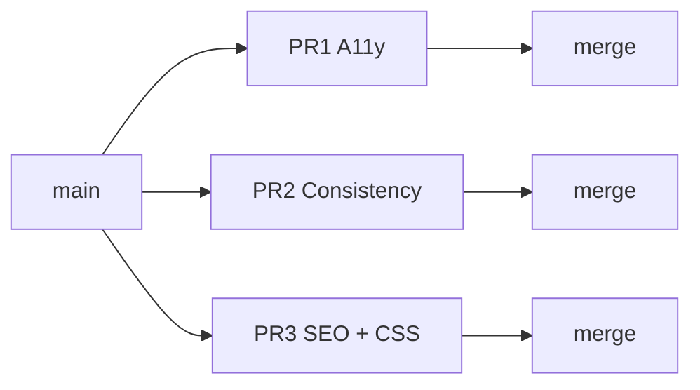

# Post-mobile implementation plan — 3 PRs

Covers all remaining audit items **except real tour photos**. Based on subagent exploration of `src/`, `docs/seo-lighthouse-audit.md`, and `docs/mobile-homepage-audit-summary.md` (Jul 2026).

**Branch strategy:** Three independent branches off `main`, merged in order. No stacking required, but PR 3 is largest — ship PR 1 and 2 first for faster wins.



---

## PR 1 — Accessibility & markup correctness

**Branch:** `fix/a11y-markup-mobile-nav`  
**Theme:** Fix invalid HTML, keyboard/mobile nav, and semantic headings.  
**Effort:** ~1 day  
**Risk:** Medium (Header focus trap needs keyboard QA)

### Scope

| # | Task | Files | Est. diff |
|---|------|-------|-----------|
| 1.1 | **Nested anchor fix** — outer card stays `<a>` to destination; inner “See tours →” becomes `<button type="button">` + `goToTours()` (matches mockup) | `src/components/vue/DestinationsCatalog.vue` | ~20 LOC |
| 1.2 | **`aria-pressed` on filter chips** | `ToursCatalog.vue`, `DestinationsCatalog.vue` | ~4 LOC |
| 1.3 | **FAQ category nav a11y** — `aria-pressed` on `.cat-link`; `min-height: var(--touch-min)` on category buttons | `FAQPage.vue` | ~15 LOC |
| 1.4 | **Mobile nav keyboard** — Escape closes drawer; focus first link on open; restore focus to toggle on close; optional `body` scroll lock; `aria-modal` on open nav | `Header.astro` (+ tiny CSS if icon swap) | ~50 LOC |
| 1.5 | **Card titles as headings** — `<p>`/`<span>` → `<h3 class="card-title|card-name|tc-name|dest-name">` (section titles stay `<h2>`) | `TourCard.astro`, `ToursCatalog.vue`, `DestinationsCatalog.vue`, `index.astro`, `destinations/[slug].astro` | ~15 LOC + CSS inherit rule |
| 1.6 | **Dest detail duplicate “Also nearby”** — hide sidebar nearby list at ≤768px (main column keeps full section) | `src/pages/destinations/[slug].astro` | ~10 LOC |

### Out of scope (defer)
- Horizontal scroll FAQ category row (UX polish, not in mockup)
- `role="tablist"` refactor for FAQ nav

### Test plan
- [ ] `/destinations` — card body → detail; “See tours →” → filtered tours only; no nested `<a>` in DOM
- [ ] Tab through destination card: distinct focus on CTA button
- [ ] `/tours`, `/destinations` — filter chips expose `aria-pressed`; URL param hydration (`/tours?type=group`) sets correct chip
- [ ] `/faq` — category buttons ≥44px; pressed state in axe/VoiceOver
- [ ] ≤768px — open nav, Tab cycles within drawer, Escape closes + focus returns to hamburger
- [ ] `/destinations/vis` mobile — one “Also nearby” block only
- [ ] Heading outline: page H1 → section H2 → card H3 (no skipped levels)
- [ ] `pnpm run check && pnpm run build`

---

## PR 2 — Copy consistency & CSS deduplication

**Branch:** `refactor/booking-css-and-cancellation-copy`  
**Theme:** Single source of truth for cancellation strings; delete ~250–350 lines of duplicated booking CSS.  
**Effort:** ~0.5–1 day  
**Risk:** Low (mostly deletion; visual regression QA on booking pages)

### Scope

| # | Task | Files | Est. diff |
|---|------|-------|-----------|
| 2.1 | **Centralize cancellation copy** — `src/config/cancellation.ts` with `SHORT`, `FULL`, `WEATHER_FAQ` constants | New file + consumers | ~40 LOC |
| 2.2 | **FAQ weather answer** — align with legal: 4h notice, full refund or rebook | `src/data/faq.ts` | ~5 LOC |
| 2.3 | **Harmonize short strings** (optional but recommended) — homepage badge + tour `policy-pill` use `CANCELLATION_SHORT` | `index.astro`, `TourDetailView.astro`, booking Vue flows, `review.astro` | ~10 LOC |
| 2.4 | **Delete duplicate step-bar CSS** (~184 lines) — rely on global `redesign.css` | `book/[slug]/group.astro`, `private.astro`, `review.astro` | −184 LOC |
| 2.5 | **Delete duplicate `.policy-note`** from Vue scoped styles | `GroupBookingFlow.vue`, `PrivateBookingFlow.vue` | −30 LOC |
| 2.6 | **Delete duplicate `.lock-note` / `.policy-box`** from review page | `book/[slug]/review.astro` | −25 LOC |
| 2.7 | **Trim booking success/error scoped CSS** — remove rules that mirror global booking-success/error blocks | `booking/success.astro`, `booking/error.astro` | −50–80 LOC |
| 2.8 | **Token housekeeping** — remove conflicting `--content-max: 1120px` from dead `tokens/colors.css`; add comment or delete unused `layout.css` / `colors.css` if confirmed dead | `src/styles/tokens/colors.css`, `layout.css` | ~5 LOC |

### Follow-up (same PR if time, else later)
- Extract `BookingStepBar.astro` component (markup duplicated 3×) — ~60 LOC saved, not blocking

### Email template note
No confirmation email template exists in repo. When added, import from `cancellation.ts`. Document in config file comment.

### Test plan
- [ ] `/faq` — cancel answer (48h) + weather answer (4h + refund/rebook)
- [ ] `/`, tour detail, group/private booking, review — short cancellation strings match
- [ ] `/legal/cancellation` unchanged and consistent with FAQ
- [ ] `/booking/success` — weather next-step copy still correct
- [ ] Step bar at 375px and 768px — scroll, label hiding, dot colors unchanged
- [ ] Policy note / lock note wrap cleanly on narrow screens
- [ ] `pnpm run check && pnpm run build`

---

## PR 3 — SEO structure, crawl hygiene & CSS modularization

**Branch:** `feat/seo-infra-and-css-modules`  
**Theme:** Internal linking, production URL guard, PWA basics, CSP, and split the 64KB monolith — **no real images**.  
**Effort:** ~1.5–2 days  
**Risk:** Medium (CSS split + CSP need preview deploy QA)

### Scope

| # | Task | Files | Est. diff |
|---|------|-------|-----------|
| 3.1 | **`PUBLIC_SITE_URL` build guard** — fail production build if unset; document in README | `astro.config.mjs` or prebuild script | ~15 LOC |
| 3.2 | **`noindex` on `/booking/details`** — meta + sitemap exclude + robots.txt | `booking/details.astro`, `astro.config.mjs`, `public/robots.txt` | ~10 LOC |
| 3.3 | **Tour detail → destination links** — `getDestinationsForTour()` in page; “Destinations on this tour” section; fix breadcrumb middle crumb | `tours/[slug].astro`, `TourDetailView.astro`, optional `lib/seo.ts` JSON-LD | ~80 LOC |
| 3.4 | **Split `redesign.css`** into modules (keep tokens separate) | New `src/styles/modules/*.css`; update imports in pages/layouts | ~400 LOC moved, net −0 |
| 3.5 | **CSP header** — permissive policy allowing Tabler CDN + inline JSON-LD; test on Netlify preview | `netlify.toml` | ~10 LOC |
| 3.6 | **PWA basics** — `apple-touch-icon.png` (180×180 from favicon), `site.webmanifest`, links in BaseLayout | `public/`, `BaseLayout.astro` | ~30 LOC + asset |
| 3.7 | **Robots sitemap URL** (optional) — generate from `PUBLIC_SITE_URL` at build instead of hardcoded | `public/robots.txt` or build script | ~20 LOC |

### CSS module split map

| Module file | Contents (from redesign.css sections) | Import where |
|-------------|----------------------------------------|--------------|
| `_base.css` | Base, utilities, layout, nav, buttons, footer | `global.css` (always) |
| `_home.css` | Hero, trust bar, steps, types, reviews, FAQ, CTA | `index.astro` or global if small |
| `_catalog.css` | Tour/dest cards, filters, cards-scroll | Global (homepage + catalogs) |
| `_tour-detail.css` | Tour detail block (~434 lines) | `tours/[slug].astro` |
| `_destination-detail.css` | Destination detail extras | `destinations/[slug].astro` |
| `_booking.css` | Booking flow, success/error | Booking pages |
| `_legal-about.css` | Legal, about, contact form | Respective pages |
| `_responsive.css` | Breakpoint overrides OR co-located per module | Per strategy chosen |

**Approach:** Phase A — extract to modules but keep single global import first (file split only). Phase B — page-scoped imports for tour/dest detail and booking (bigger perf win). PR 3 should complete at least Phase A; Phase B if time allows.

### CSP starter policy

```
default-src 'self';
script-src 'self' 'unsafe-inline';
style-src 'self' https://cdn.jsdelivr.net 'unsafe-inline';
font-src 'self' https://cdn.jsdelivr.net;
img-src 'self' data:;
connect-src 'self';
frame-ancestors 'none';
```

Tighten after future Tabler → inline SVG migration (explicitly deferred).

### Explicitly deferred (not in any of these 3 PRs)

- Real tour photos / `TourImage.astro` wiring
- Tabler webfont → inline SVG (8–16 hrs)
- Booking flow product decisions (availability holds, guest manifest, my bookings)
- Interactive destinations map
- Hero real photograph
- Email template implementation
- Lighthouse full pass + Search Console submission (do after PR 3 merge)
- `twitter:site`, SearchAction schema, AggregateRating schema

### Test plan
- [ ] `PUBLIC_SITE_URL=https://hellobluecave.com pnpm build` succeeds; build fails without env in CI mode
- [ ] `/booking/details` — `noindex` in meta; excluded from sitemap
- [ ] `/tours/blue-cave-hvar-5-islands` — destination chips link to `/destinations/*`; breadcrumb sane
- [ ] All page templates visually unchanged after CSS split (spot-check 10 routes)
- [ ] Netlify preview — no CSP console errors on homepage, tours, booking
- [ ] iOS Add to Home Screen — manifest + apple-touch-icon resolve
- [ ] `pnpm run check && pnpm run build`

---

## Merge order & rationale

| Order | PR | Why first |
|-------|-----|-----------|
| 1 | PR 1 A11y | Smallest behavioral risk isolated; fixes invalid HTML before SEO crawl improvements |
| 2 | PR 2 Consistency | Pure cleanup; reduces CSS drift before modularization |
| 3 | PR 3 SEO + CSS | Largest diff; benefits from stable booking/a11y baseline |

PR 1 and PR 2 can be developed **in parallel** on separate branches. PR 3 should start after PR 2 merges (CSS dedup before CSS split avoids merge conflicts in booking pages).

---

## Post-merge validation (all 3 PRs)

Run once after PR 3 lands:

```bash
PUBLIC_SITE_URL=https://hellobluecave.com pnpm run check
PUBLIC_SITE_URL=https://hellobluecave.com pnpm run build
pnpm run preview
```

**Mobile spot-check (390px):** `/`, `/tours`, `/destinations`, `/faq`, `/book/blue-cave-hvar-5-islands/group`, `/tours/blue-cave-hvar-5-islands`, `/destinations/vis`

**Desktop spot-check:** Same routes + `/legal/cancellation`, `/booking/details` (noindex only)

**Optional:** Lighthouse on homepage + tour detail + booking review templates.

---

## Effort summary

| PR | Focus | Est. time |
|----|-------|-----------|
| PR 1 | A11y & markup | 1 day |
| PR 2 | Copy + CSS dedup | 0.5–1 day |
| PR 3 | SEO + CSS modules + infra | 1.5–2 days |
| **Total** | | **~3–4 days** |
